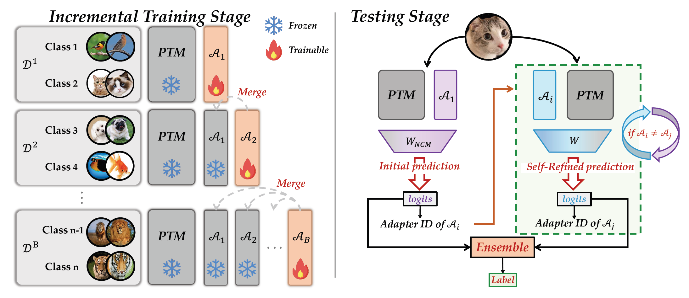
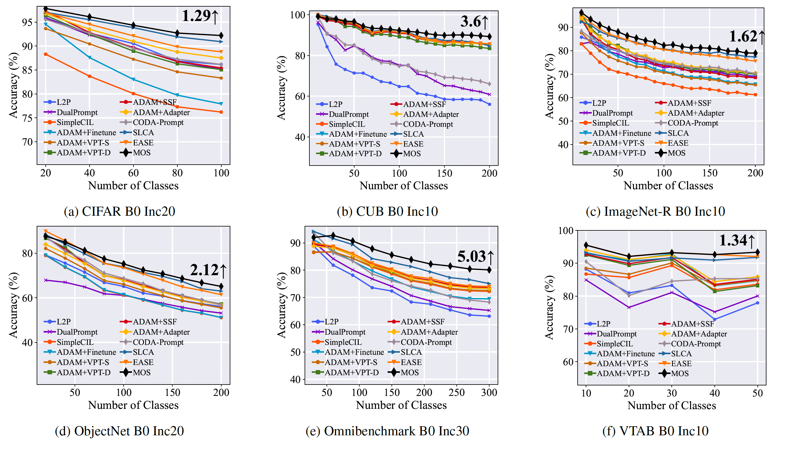
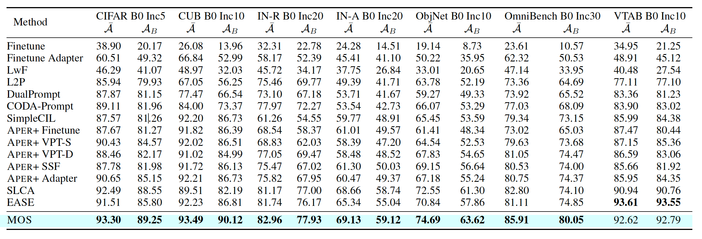

# MOS: Model Surgery for Pre-Trained Model-Based Class-Incremental Learning

<div align="center">

<div>
  <a href='http://www.lamda.nju.edu.cn/sunhl' target='_blank'>Hai-Long Sun</a><sup>1,2</sup>&emsp;
    <a href='http://www.lamda.nju.edu.cn/zhoudw' target='_blank'>Da-Wei Zhou</a><sup>1,2</sup>&emsp;
    <a href='https://scholar.google.com/citations?user=F2kiw10AAAAJ&hl=en' target='_blank'>Hanbin Zhao</a><sup>3</sup>&emsp;
    <a href='https://scholar.google.com/citations?user=cCD5SDoAAAAJ&hl=en' target='_blank'>Le Gan</a><sup>1,2</sup>&emsp;
    <a href='http://www.lamda.nju.edu.cn/zhandc' target='_blank'>De-Chuan Zhan</a><sup>1,2</sup>&emsp;
    <a href='http://www.lamda.nju.edu.cn/yehj' target='_blank'>Han-Jia Ye</a><sup>1,2</sup>&emsp;
</div>
<div>

  <sup>1</sup>School of Artificial Intelligence, Nanjing University&emsp;
  <sup>2</sup>State Key Laboratory for Novel Software Technology, Nanjing University&emsp;
  <sup>3</sup>College of Computer Science and Technology, Zhejiang University&emsp;

</div>
</div>
<p align="center">
  <a href=""></a>
  <a href='https://arxiv.org/abs/2412.09441'></a>
  <a href=""></a>
  <a href=""></a>
</p>

🎉The code repository for "[MOS: Model Surgery for Pre-Trained Model-Based Class-Incremental Learning](http://arxiv.org/abs/2412.09441)" (AAAI 2025) in PyTorch. If you use any content of this repo for your work, please cite the following bib entry:

```
  @inproceedings{sun2024mos,
    title={MOS: Model Surgery for Pre-Trained Model-Based Class-Incremental Learning},
    author={Sun, Hai-Long and Zhou, Da-Wei and Zhao, Hanbin and Gan, Le and Zhan, De-Chuan and Ye, Han-Jia},
    booktitle={AAAI},
    year={2025}
  }
```

## Overview
Class-Incremental Learning (CIL) requires models to continually acquire knowledge of new classes without forgetting old ones. Despite Pre-trained Models (PTMs) have shown excellent performance in CIL, catastrophic forgetting still occurs as the model learns new concepts. Existing work seeks to utilize lightweight components to adjust the PTM, while the forgetting phenomenon still comes from *parameter and retrieval* levels. Specifically, iterative updates of the model result in parameter drift, while mistakenly retrieving irrelevant modules leads to the mismatch during inference. 

To this end, we propose MOdel Surgery (MOS) to rescue the model from forgetting previous knowledge. By training task-specific adapters, we continually adjust the PTM to downstream tasks. To mitigate parameter-level forgetting, we present an adapter merging approach to learn task-specific adapters, which aims to bridge the gap between different components while reserve task-specific information. Besides, to address retrieval-level forgetting, we introduce a training-free self-refined adapter retrieval mechanism during inference, which leverages the model's inherent ability for better adapter retrieval. By jointly rectifying the model with those steps, MOS can robustly resist catastrophic forgetting in the learning process. Extensive experiments on seven benchmark datasets validate MOS's state-of-the-art performance.



## 🎊 Results

We conducted experiments on seven benchmark datasets to verify the competitive performance of MOS.





## Requirements
### 🗂️ Environment
1. [torch 2.0.1](https://github.com/pytorch/pytorch)
2. [torchvision 0.15.2](https://github.com/pytorch/vision)
3. [timm 0.6.12](https://github.com/huggingface/pytorch-image-models)

### 🔎 Dataset
We provide the processed datasets as follows:
- **CIFAR100**: will be automatically downloaded by the code.
- **CUB200**:  Google Drive: [link](https://drive.google.com/file/d/1XbUpnWpJPnItt5zQ6sHJnsjPncnNLvWb/view?usp=sharing) or Onedrive: [link](https://entuedu-my.sharepoint.com/:u:/g/personal/n2207876b_e_ntu_edu_sg/EVV4pT9VJ9pBrVs2x0lcwd0BlVQCtSrdbLVfhuajMry-lA?e=L6Wjsc)
- **ImageNet-R**: Google Drive: [link](https://drive.google.com/file/d/1SG4TbiL8_DooekztyCVK8mPmfhMo8fkR/view?usp=sharing) or Onedrive: [link](https://entuedu-my.sharepoint.com/:u:/g/personal/n2207876b_e_ntu_edu_sg/EU4jyLL29CtBsZkB6y-JSbgBzWF5YHhBAUz1Qw8qM2954A?e=hlWpNW)
- **ImageNet-A**: Google Drive: [link](https://drive.google.com/file/d/19l52ua_vvTtttgVRziCZJjal0TPE9f2p/view?usp=sharing) or Onedrive: [link](https://entuedu-my.sharepoint.com/:u:/g/personal/n2207876b_e_ntu_edu_sg/ERYi36eg9b1KkfEplgFTW3gBg1otwWwkQPSml0igWBC46A?e=NiTUkL)
- **OmniBenchmark**: Google Drive: [link](https://drive.google.com/file/d/1AbCP3zBMtv_TDXJypOCnOgX8hJmvJm3u/view?usp=sharing) or Onedrive: [link](https://entuedu-my.sharepoint.com/:u:/g/personal/n2207876b_e_ntu_edu_sg/EcoUATKl24JFo3jBMnTV2WcBwkuyBH0TmCAy6Lml1gOHJA?e=eCNcoA)
- **VTAB**: Google Drive: [link](https://drive.google.com/file/d/1xUiwlnx4k0oDhYi26KL5KwrCAya-mvJ_/view?usp=sharing) or Onedrive: [link](https://entuedu-my.sharepoint.com/:u:/g/personal/n2207876b_e_ntu_edu_sg/EQyTP1nOIH5PrfhXtpPgKQ8BlEFW2Erda1t7Kdi3Al-ePw?e=Yt4RnV)
- **ObjectNet**: Onedrive: [link](https://entuedu-my.sharepoint.com/:u:/g/personal/n2207876b_e_ntu_edu_sg/EZFv9uaaO1hBj7Y40KoCvYkBnuUZHnHnjMda6obiDpiIWw?e=4n8Kpy) You can also refer to the [filelist](https://drive.google.com/file/d/147Mta-HcENF6IhZ8dvPnZ93Romcie7T6/view?usp=sharing) if the file is too large to download.

You need to modify the path of the datasets in `./utils/data.py`  according to your own path.
> These datasets are referenced in the [Aper](https://github.com/zhoudw-zdw/RevisitingCIL) 

## 🔑 Running scripts

Please follow the settings in the `exps` folder to prepare json files, and then run:

```
python main.py --config ./exps/[filename].json
```

**Here is an example of how to run the code** 

if you want to run the cifar dataset using ViT-B/16-IN1K, you can follow the script: 
```
python main.py --config ./exps/mos_cifar.json
```

if you want to run the cifar dataset using ViT-B/16-IN21K, you can follow the script: 
```
python main.py --config ./exps/mos_cifar_in21k.json
```

After running the code, you will get a log file in the `logs/mos/cifar224/` folder.

## 👨‍🏫 Acknowledgment

We would like to express our gratitude to the following repositories for offering valuable components and functions that contributed to our work.

- [PILOT: A Pre-Trained Model-Based Continual Learning Toolbox](https://github.com/sun-hailong/LAMDA-PILOT)
- [RevisitingCIL](https://github.com/zhoudw-zdw/RevisitingCIL)